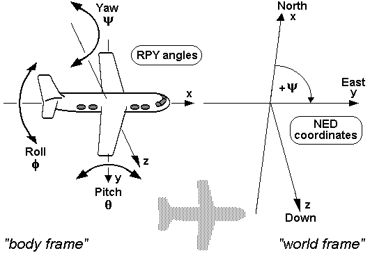

## UAVCAN v0 Specification 5.Application-level conventions

## Contents
### Application-level conventions
 - ID distribution
	 - Message type ID
	 - Service type ID
	 - Node ID
 - Coordinate frames and rotation representation
 - Matrix representation
	 - Covariance matrix
 - Engineering units

## Application-level conventions（应用层约束）
### ID distribution （ID 分配）
#### Message type ID （消息类型 ID）
The valid range for message type ID is from 0 to 65535, inclusive (see CAN bus transport layer specification). The range is segmented as follows:  
消息类型 ID 的有效范围是从 0 到 65535（参见 4.CAN bus transport layer）。范围细分如下：  

| ID range | Purpose |
| :--- | :--- |
| [0, 20000) | Standard message types |
| [20000, 21000) | Vendor-specific message types |
| [21000, 65536) | Reserved for future use |

#### Service type ID (服务类型 ID)
The valid range for service type ID is from 0 to 255, inclusive (see CAN bus transport layer specification). The range is segmented as follows:  
服务类型ID的有效范围是0到255（参见 4.CAN bus transport layer）。范围细分如下：  

| ID range | Purpose |
| :--- | :--- |
|[0, 100) |	Standard service types |
|[100, 200) |	Reserved for future use |
|[200, 256) |	Vendor-specific service types |

#### Node ID （节点 ID）
The valid range for node ID is from 1 to 127, inclusive (see CAN bus transport layer specification).  
节点ID 的有效范围是从1到127（参见 4.CAN bus transport layer）。

The values 126 and 127 are reserved for debugging tools and should not be used for real nodes.  
126和127保留给调试工具，不应该用于实际的节点。

### Coordinate frames and rotation representation （坐标系和旋转表达）
UAVCAN follows the conventions that are widely accepted in various aerospace applications.  
UAVCAN 遵循在各种航空航天应用中被广泛接受的公约。

All systems are right handed. In relation to a body, the standard is as follows:  
所有的系统都是右手系。就飞机机体而言，标准如下:

 - X forward
 - Y right
 - Z down
 

In the case of cameras, the following convention should be preferred:  
对于相机，应优先采用下列公约：

 - Z forward
 - X right
 - Y down
 
 
For world frames, the North-East-Down (NED) notation should be preferred.  
对于世界坐标系，应该首(NED)。

The default rotation representation is quaternion. The coefficients are ordered as follows: X, Y, Z, W.  
默认的旋转方案表示是四元数。系数排序如下:X, Y, Z, W。

Angular velocities should be represented in fixed axis roll (about X), pitch (about Y), and yaw (about Z).  
角速度应该用固定轴的横滚（关于X）、俯仰（关于Y）和偏航（关于Z）来表示。

### Matrix representation （矩阵表示）
Matrices should be represented as flat arrays in row-major order. There are some standard ways to represent an N-by-N square matrix in a one-dimensional array:  
矩阵应该用以行顺序为主的方式表达。用一维数组表示 N x N 阶的方阵有几个标准方式:

 - An empty array represents a zero matrix.  
 - 一个空数组表示一个零矩阵。
   
 - An array of one element represents a scalar matrix.  
 - 一个元素的数组表示一个标量矩阵。
   
 - An array of N elements represents a diagonal matrix, where each array member Ai equals the matrix element Mi,i.  
 - N 个元素的数组表示一个对角矩阵，其中每个数组成员 Ai 等于矩阵元素 Mi,i。
   
 - An array of ((1+N)*N)/2 elements represents a symmetric matrix, where array members represent elements of the upper-right triangle arranged in row-major order. For example, a 3-by-3 symmetric matrix can be represented as a flat array containing 6 matrix elements in the following order: [M1,1, M1,2, M1,3, M2,2, M2,3, M3,3].  
 - 一个由 ((1+N)*N)/2 个元素组成的数组表示一个对称矩阵，其中数组成员表示按行主序排列的右上角三角形的元素。例如，一个 3×3 对称矩阵可以表示为一个包含 6 个矩阵元素的平面阵列，其顺序如下：[M1,1, M1,2, M1,3, M2,2, M2,3, M3,3]。
   
 - An array of size N2 elements represents a full square matrix.  
 - 一个大小为 N2 个元素的数组表示一个完整的方阵。

#### Covariance matrix (协方差矩阵)
A zero covariance matrix represents an unknown covariance.  
零协方差矩阵表示未知协方差。

Positive infinity in variance means that the associated value is undefined. Alternatively, in some cases, the value itself can be set to NAN (not-a-number float constant) to indicate that the parameter value is not defined. Note though that it is recommended to avoid NAN and infinities whenever possible for portability reasons.  
方差正无穷意味着相关值没有定义。或者，在某些情况下，可以将值本身设置为 NAN（浮点常量），以指示没有定义参数值。注意，由于可移植性的原因，建议尽可能避免 NAN 和无穷。

### Engineering units (工程单位)
All units are SI units, unless explicitly noted otherwise.  
所有的单位都是国际单位制，除非另有明确说明。

The following field naming convention is used:  
约定字段命名使用以下规则：

 - Fields that contain values not in SI units must be suffixed with the unit name, e.g., battery_capacity_wh (“wh” is for “Watt-hours” in this example).  
 - 不包含在国际单位制中的值必须添加单位名作为后缀，例如，battery_capacity_wh（“wh”表示“瓦特每小时”）。
  
 - Fields that contain values in SI units are not suffixed, e.g., voltage (implying that the units are Volts).  
 - 国际单位制的字段不需要单位明作为后缀，例如，电压（表示单位是伏特）。
 
If an application designer chooses to deviate, such decision should be properly documented.  
如果应用程序设计人员选择其他方式，则应适当地记录并表示。