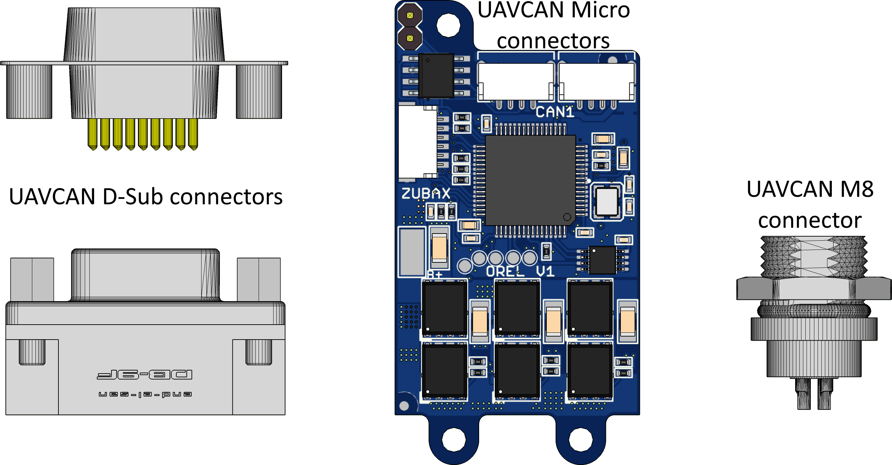
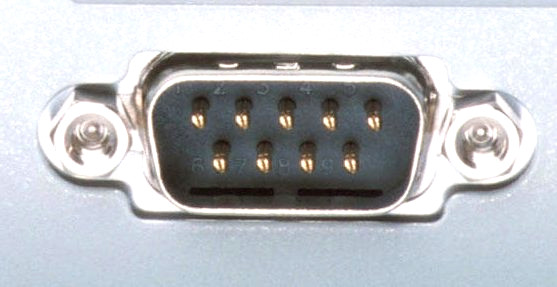
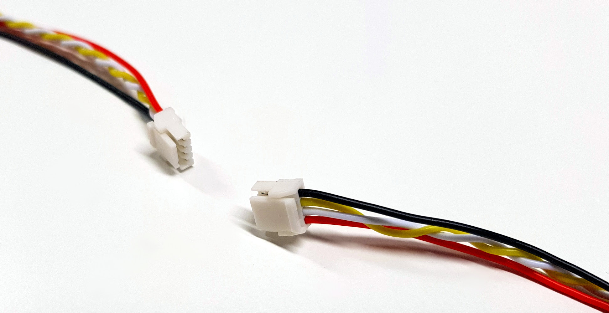
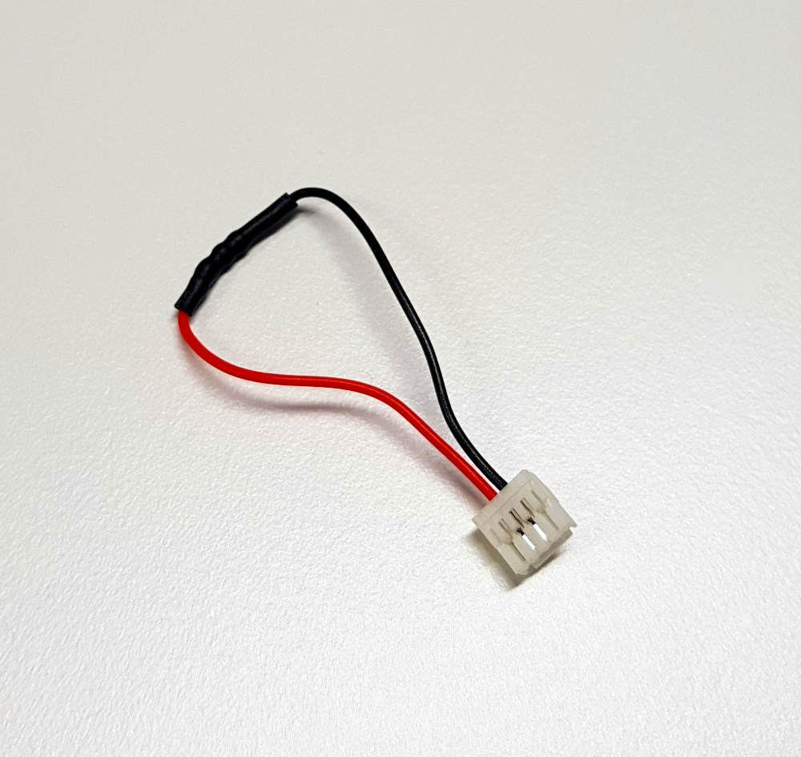
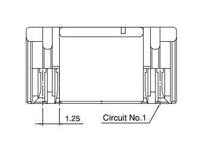
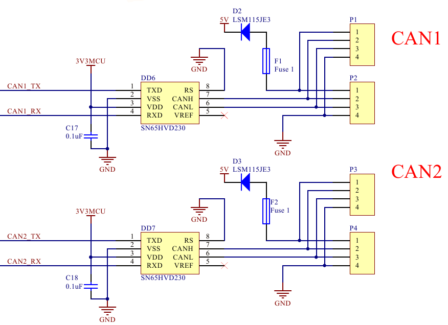

## UAVCAN v0 Specification 8.Hardware design recommendations

## Contents
### Hardware design recommendations
 - Physical connector definition
	 - UAVCAN D-Sub connector
	 - UAVCAN M8 connector
	 - UAVCAN Micro connector
 - Design recommendations
	 - Connectors
	 - Devices with different number of redundant interfaces
	 - Bus power supply
	 - CAN bus parameters

## Hardware design recommendations (硬件设计建议)
This chapter contains best-practice recommendations for hardware design.  
本章包含硬件设计的最佳实践建议。  

Following these guidelines will ensure the highest level of inter-vendor compatibility and allow the developers to avoid many common design pitfalls.  
遵循这些准则将确保最高层的供应商间兼容性，帮助开发人员避免许多常见的设计陷阱。

### Physical connector definition (物理接口定义)
The UAVCAN standard defines several connector types, targeted towards different application domains: from highly compact systems to large deployments, from low-cost to safety-critical applications.  
UAVCAN 标准定义了几种针对不同应用领域的连接器类型：从高度紧凑的系统到大型部署，从低成本到安全关键型应用。

The following table provides an overview of the currently defined connector types. The image to the right comparatively demonstrates the size of the connector types.  
下表提供了当前定义的连接器类型的概述。右边的图像比较地显示了连接器类型的大小。

Other connector types may be added in future revisions of the specification.  
其他连接器类型可以在规范的未来修订中添加。

|Connector name	|Base connector type	|Bus power	|Known compatible standards|
|:---|:---|:---|:---|
|UAVCAN D-Sub|	Generic D-Subminiature DE-9	| 24 V, 3 A	| De-facto standard connector for CAN, supported by many current specifications|
|UAVCAN M8|	Generic M8 5-circuit B-coded |	24 V, 3 A	| CiA 103 (CANopen)|
|UAVCAN Micro|	JST GH 4-circuit |	5 V, 1 A |	Dronecode Autopilot Connector Standard|

#### UAVCAN D-Sub connector 
The UAVCAN D-Sub connector type is based upon, and compatible with, the D-Subminiature DE-9 CAN connector (this is the most popular CAN connector type, in effect the de-facto industry standard). This connector is fully compatible with CANopen and many other current specifications.  
UAVCAN D-Sub 连接器类型基于并兼容 D-Subminiature DE-9 CAN 连接器（这是最流行的 CAN 连接器类型，实际上是行业标准）。此连接器与 CANopen 以及许多其他当前规范完全兼容。

##### Advantages （优势）
 - Highest level of compatibility with the existing commercial off the shelf (COTS) hardware. Connectors, cables, termination plugs, and other components can be easily purchased from many different vendors.  
 - 与现有商用现货（COTS）硬件的最高兼容性。连接器、电缆、终端插头和其他组件可以很容易地从许多不同的供应商那里购买到。
   
 - High-reliability options are available from multiple vendors.  
 - 多个供应商支持高可靠性选项。
   
 - Low-cost options are available from multiple vendors.  
 - 多个供应商提供了低成本的选择。
   
 - PCB mounted and panel mounted types are available.  
 - 支持印刷电路板安装和面板安装的类型。

##### Disadvantages （缺点）
D-Subminiature connectors are the largest connector type defined by UAVCAN. Due to its significant size and weight, it may be unsuitable for many vehicular applications.  
D-Subminiature 连接器是 UAVCAN 定义的最大的连接器类型。由于其显著的尺寸和重量，它可能不适合许多车辆应用。

The UAVCAN D-Sub connector is based on the industry-standard D-Sub DE-9 (9-circuit) connector type. Devices are equipped with the male plug connector type (see the image) mounted on the panel or on the PCB, and the cables are equipped with the female socket connectors on both ends.  
UAVCAN D-Sub 连接器基于工业标准的D-Sub DE-9 (9-circuit)连接器类型。在面板或PCB上安装使用公头连接器（见图），电缆两端安装母头。

If the device uses two parallel connectors per CAN bus interface (as recommended), then all of the lines of the paired connectors, including those that are not used by the current specification, must be interconnected one to one. This will ensure compatibility with future revisions of the specification that make use of currently unused circuits of the connector.  
如果设备每个 CAN 总线接口使用两个并行连接器（推荐使用），那么所有成对连接器的线路，包括当前规范中没有使用的那些线路，都必须一对一地互连。这将确保与使用当前未使用的连接器电路的规范的未来修订兼容。

The CAN physical layer standard that can be used with this connector type is ISO 11898-2, also known as high-speed CAN.  
可以与此连接器类型一起使用的 CAN 物理层标准是 ISO 11898-2，也称为高速 CAN。

Devices that deliver power to the bus are required to provide 23.0—30.0 V on the bus power line, 24 V nominal. The maximum current draw is up to 3 A per connector.  
为总线供电的设备需要在总线电力线上提供 23.0-30.0 V，额定电压为 24 V。最大电流是每连接器最多 3 A。

Devices that are powered from the bus should expect 18.0—30.0 V on the bus power line. The maximum recommended current draw from the bus is 500 mA per device.  
从总线供电的设备应预期总线电源线上的电压为 18.0-30.0 V。从总线引出的最大推荐电流为每个设备 500mA。

The table below documents the pinout specification for the UAVCAN D-Sub connector type. The provided pinout, as has been indicated above, is the de-facto industry standard for the CAN bus. Note that the signals CAN High and CAN Low must belong to the same twisted pair. Usage of twisted or flat wires for all other signals remains at the discretion of the implementer.  
下表记录了 UAVCAN D-Sub 连接器类型的 pinout 规范。如上所述，所提供的 pinout 是 CAN 总线事实上的行业标准。注意，CAN High和 CAN Low 的信号必须使用双绞线。所有其他信号是使用绞合还是单线由设计者自行决定。  

|Circuit number|	Function|	Note|
|:---|:---|:---|
|1|	| 	Reserved for future use.|
|2|	CAN Low|	Twisted with CAN High (pin 7).|
|3|	CAN Ground|	Must be interconnected with Ground (pin 6) within the device.|
|4|	 	|Reserved for future use.|
|5|	CAN Shield|	Optional.|
|6|	Ground|	Must be interconnected with CAN Ground (pin 3) within the device.|
|7|	CAN High|	Twisted with CAN Low (pin 2).|
|8|	 	|Error line, not used by UAVCAN. See CiA 303 for details.|
|9|	Bus power supply|	24 V nominal. Power supply requirements are documented above.|

#### UAVCAN M8 connector
The UAVCAN M8 connector is based on the standard circular M8 B-coded 5-circuit connector type (pictured). This is a popular industry-standard connector, and there are many vendors that manufacture compatible components: connectors, cables, termination plugs, T-connectors, and so on. The pinning, physical layer, and supply voltages used in this connector type are compatible with CiA 103 (CANopen) and some other CAN bus standards.  
UAVCAN M8 连接器是基于标准的圆形M8 B-coded 5-circuit连接器类型（如图所示）。这是一个流行的行业标准连接器，有许多供应商生产兼容的组件：连接器、电缆、终端插头、T-型连接器等等。这种连接器类型中使用的针脚、物理层和电源电压与 CiA 103 (CANopen)和其他一些 CAN 总线标准兼容。  

The M8 connector is preferred for most UAVCAN applications (it is the default choice, except when there are specific reasons to select another connector).  
对于大多数 UAVCAN 应用程序，M8 连接器是首选的（这是默认的选择，除非有特殊的原因需要选择另一个连接器）。

##### Advantages （优势）
 - Compatibility with existing COTS hardware. Connectors, cables, termination plugs, and other components can be purchased from many different vendors.  
 - 与现有商用现货（COTS）硬件的最高兼容性。连接器、电缆、终端插头和其他组件可以很容易地从许多不同的供应商那里购买到。
   
 - High-reliability options are available from multiple vendors.  
 - 多个供应商支持高可靠性选项。
   
 - Low-cost options are available from multiple vendors.  
 - 多个供应商提供了低成本的选择。
   
 - Reasonably compact. M8 connectors are much smaller than D-Sub.  
 - 更紧凑。M8 连接器比 D-Sub 小得多。
   
 - PCB mounted and panel mounted types are available.  
 - 支持印刷电路板安装和面板安装的类型。

##### Disadvantages （缺点）
M8 connectors may be a poor fit for applications that have severe weight and space constraints.  
对于具有严重的重量和空间限制的应用程序，M8连接器可能不太适合。

The level of adoption in the industry is noticeably lower than that of the D-Sub connector type.  
该连接器的行业的采用水平明显低于 D-Sub 连接器类型。
 
##### Specification （规范）
The UAVCAN M8 connector is based on the industry-standard circular M8 B-coded 5-circuit connector type. Devices are equipped with the male plug connector type (see the image) mounted on the panel or on the PCB, and the cables are equipped with the female socket connectors on both ends. Do not confuse A-coded and B-coded M8 connectors — they are not mutually compatible.  
UAVCAN M8 连接器基于行业标准圆形 M8 B-coded 5-circuit 连接器类型。在面板或PCB上安装连接器公头（见图），电缆两端安装连接器母头。不要混淆 A-coded and B-coded 的 M8 连接器——它们不是相互兼容的。

The CAN physical layer standard that can be used with this connector type is ISO 11898-2, also known as high-speed CAN.  
可以与此连接器类型一起使用的 CAN 物理层标准是 ISO 11898-2，也称为高速 CAN。

Devices that deliver power to the bus are required to provide 23.0—30.0 V on the bus power line, 24 V nominal. The maximum current draw is up to 3 A per connector.  
为总线供电的设备需要在总线电力线上提供 23.0-30.0 V，额定电压为 24 V。最大电流是每连接器最多 3 A。

Devices that are powered from the bus should expect 18.0—30.0 V on the bus power line. The maximum recommended current draw from the bus is 500 mA per device.  
从总线供电的设备应预期总线电源线上的电压为 18.0-30.0 V。从总线引出的最大推荐电流为每个设备 500mA。

The table below documents the pinout specification for the UAVCAN M8 connector type. The provided pinout, as indicated above, is compatible with the CiA 103 specification (CANopen). Note that the wires CAN High and CAN Low should be a twisted pair.  
下表记录了 UAVCAN M8 连接器类型的 pinout 规范。如上所示，所提供的 pinout 与 CiA 103 规范(CANopen)兼容。注意电线 CAN High 和 CAN Low 应该是双绞线。

| Circuit number | Function | Note |
| :-- | :-- |
| 1 | Bus power supply|	24 V nominal. Power supply requirements are documented above. |
| 2 | CAN Shield | Optional. |
| 3 | CAN High | Twisted with CAN Low (pin 4). |
| 4 | CAN Low | Twisted with CAN High (pin 3). |
| 5 | Ground| |

#### UAVCAN Micro connector
The UAVCAN Micro connector is intended for weight- and space-sensitive applications. It is a board-level connector, meaning that it can be installed on the PCB rather than on the panel.  
UAVCAN 微型连接器适用于对重量和空间都敏感的应用。它是一个板级连接器，这意味着它可以安装在 PCB 上，而不是面板上。

The Micro connector is compatible with the Dronecode Autopilot Connector Standard. This connector type is recommended for small UAV and nanosatellites. It is also the recommended connector for attaching external panel-mounted connectors (such as the M8 or D-Sub types) to the PCB inside the enclosure.  
微连接器与 Dronecode 自动驾驶仪连接器标准兼容。这种连接器类型推荐用于小型无人机和纳米卫星。它也是推荐的连接器，用于将外部面板安装的连接器（如 M8 或 D-Sub 类型）连接到外壳内的 PCB 上。

##### Advantages (优势)
 - Extremely compact, low-profile. The PCB footprint is under 9✕5 millimeters.  
 - 非常紧凑，占空间小。PCB的封装小于 9 x 5 mm。
  
 - Secure positive lock ensures that the connection will not self-disconnect when exposed to vibrations.  
 - 防呆设计，自锁连接，受震动时不易断开。
  
 - Low-cost, easy to stock.  
 - 低成本，容易储存。

##### Disadvantages （缺点）
 - Board-level connections only. No panel-mounted options available.  
 - 仅有PCB级别连接。没有面板安装选项可用。
   
 - No shielding available.  
 - 无屏蔽层。
  
 - Not suitable for safety-critical hardware.  
 - 不适合在安全要求高的关键硬件。

##### Specification (规范)
The Micro connector is based on the proprietary JST GH 4-circuit connector type.  
微连接器是基于有 JST 品牌的 GH 4-circuit 连接器类型。

The suitable cable types are flat or twisted pair #30 to #26 AWG, outer insulation diameter 0.8—1.0 mm, multi-strand. Non-twisted (flat) cables can only be used in very small deployments free of significant EMI, otherwise reliable functioning of the bus cannot be guaranteed.  
合适的电缆类型为#30 ~ #26AWG 单线或双绞线，外绝缘直径 0.8 ~ 1.0 mm，多股。非绞线（平整线）电缆只能在非常小的没有明显的电磁干扰的环境部署应用，否则无法保证总线的可靠运行。

The CAN physical layer standard that can be used with this connector type is ISO 11898-2, also known as high-speed CAN.  
可以与此连接器类型一起使用的 CAN 物理层标准是 ISO 11898-2，也称为高速 CAN。

Devices that deliver power to the bus are required to provide 5.0—5.5 V on the bus power line. The anticipated current draw is up to 1 A per connector.  
为总线供电的设备需要在总线电力线上提供 5.0-5.5 V 的电压。最大电流是每个连接器 1 A。

Devices that are powered from the bus should expect 4.0—5.5 V on the bus power line. The maximum recommended current draw from the bus is 500 mA per device.  
从总线供电的设备应该期望在总线电力线上有 4.0-5.5 V 的电压。从总线引出的最大推荐电流为每个设备 500 mA。

| Circuit number |  Function | Recommended wire designation for 25-pair-color-coded cables |
|:---|:---|:---|
| 1 |	Bus power supply | pair 1 tip |
| 2 |	CAN High | pair 2 ring |
| 3 |	CAN Low	| pair 2 tip |
| 4 |	Ground | pair 1 ring |

### Design recommendations (设计建议)

#### Connectors （连接器）
It is highly recommended to provide two identical parallel connectors for each CAN interface per device, so that the device can be connected to the bus without the need to use T-connectors. T-connectors should be avoided when possible because generally they add an extra point of failure, increase the stub length, weight, and often require more complex and expensive wiring harnesses.  
强烈建议为每个设备的每个 CAN 接口提供两个相同的并行连接器，以便设备可以连接到总线，而不需要使用 T 型连接器。应尽可能避免使用 T 型连接器，因为它们通常会增加一个额外的故障点，增加接线点的长度和重量，而且通常需要更复杂和昂贵的线束。  

The figure below demonstrates a CAN bus wired according to the above recommendation.  
下图演示了根据上述建议连接的CAN总线。

The next figure shows a bus where the devices are equipped with doubly redundant interfaces. The same principles apply to a triply-redundant bus as well.  
下一个图显示了一个总线，其中设备配备了双重冗余接口。同样的原理也适用于三冗余总线。

UAVCAN permits keeping one of the redundant interfaces unused. An example of such wiring is shown on the following figure.  
UAVCAN 允许保留一个未使用的冗余接口。下图显示了这种连接的一个示例。

#### Devices with different number of redundant interfaces（具有不同数量冗余接口的设备）
Mission critical devices and non-mission critical devices often need to co-exist on the same UAVCAN network. Non-mission critical devices are likely to be equipped with a non-redundant CAN bus interface, which can create the situation where multiple devices with a different number of redundant interfaces need to be connected to the same UAVCAN network.  
任务关键型设备和非任务关键型设备通常需要共存于同一个UAVCAN网络上。非任务关键型设备可能会配备一个非冗余CAN总线接口，这可能会导致具有不同数量冗余接口的多个设备需要连接到同一个 UAVCAN 网络。

If multiple devices with a different number of interfaces need to co-exist on the same UAVCAN network, the following rules should be followed:  
如果多个具有不同数量接口的设备需要在同一个UAVCAN网络上共存，应遵循以下规则：

 - Each available CAN bus (UAVCAN supports up to 3) is assigned a level of importance (primary or backup).  
 - 每个可用的 CAN 总线（UAVCAN 最多支持 3 个）被分配一个重要级别（主或备份）。
    
 - All devices should be connected to the primary CAN bus.  
 - 所有设备应连接到主 CAN 总线。
    
 - Only devices with redundant interfaces should be also connected to the backup bus/buses.  
 - 只有具有冗余接口的设备，需要接到备份总线。

 The figure below shows a doubly redundant CAN bus, but the same considerations apply to a triply redundant bus:  
 下图显示了一个双冗余的 CAN 总线，但是同样的设计也适用于一个三冗余的总线：  
 

#### Bus power supply （总线供电）
##### Bus-powered devices (需要总线供电的设备)
This section applies to devices that draw power from the bus.  
本节适用于从总线吸取能量的设备。

Each power input must be protected with an overcurrent protection circuit (for example, a fuse), so that an accidental short circuit on the device will not bring down the power on the entire bus.  
每个电源输入必须有一个过流保护电路（例如，保险丝），这样设备上的意外短路就不会使整个总线的电源中断。

If the device incorporates redundant bus interfaces, it must prevent direct current flow between power inputs from different interface connectors, so that if one bus suffers a power failure (e.g. a short circuit) it won’t be propagated to other buses.  
如果设备包含冗余的总线接口，它必须防止来自不同接口连接器的电源输入之间的直接连接，只有这样做了，当一个总线发生电源故障时（例如短路），它才不会传播到其他总线。

##### Bus-powering devices（为总线提供电源的设备）
This section applies to devices that deliver power to the bus.  
本节适用于为总线供电的设备。

Similar to the case of bus-powered devices, UAVCAN power sources should take into account that one of the redundant interfaces may suffer a short circuit or a failure of similar mode. Should that happen, the power source should shut down the failing bus and continue to supply the remaining bus interfaces.  
与总线供电设备的情况类似，UAVCAN 电源应考虑其中一个冗余接口可能发生短路或类似模式故障。如果发生这种情况，电源应该关闭故障总线并继续提供剩余的总线接口。

#### CAN bus parameters （CAN 总线参数）
UAVCAN is bit rate agnostic, so technically any bit rate can be used as long as it is supported by the physical layer. However, only the recommended bit rates from the table below should be used to ensure compatibility.  
UAVCAN 协议本身是和位速率无关的，所以从技术上讲，只要物理层支持的速率，就可以使用它。但是，应该只使用下表中推荐的比特率来确保兼容性。

|Bit rate |	Valid range for location of sample point |	Recommended location of sample point	 |Max bus length	|Max stub length|
| :---|:---|:---|:---|:---|
|1000 kbit/s| 75% to 90%	|87.5%|	40 m|	0.3 m|
|500 kbit/s|	85% to 90%	|87.5%	|100 m	|0.3 m|
|250 kbit/s|	85% to 90%	|87.5%	|250 m	|0.3 m|
|125 kbit/s|	85% to 90%	|87.5%	|500 m	|0.3 m|

The estimated bus length limits are based on the assumption that the propagation delay does not exceed 5 ns/m, not including additional delay times of CAN transceivers and other components.  
估计的总线长度限制是基于传播延迟不超过 5ns/m 的假设，不包括 CAN 收发器和其他组件的额外延迟时间。

##### Automatic bit rate detection (自动比特率检测)
Designers are encouraged to implement CAN auto bit rate detection when applicable. Please refer to the CiA 801 application note for recommended practices.  
鼓励设计者在适用时实现自动比特率检测。请参阅CiA 801申请说明中的建议操作。

UAVCAN enables the use of the simple bit time measuring approach, as it is guaranteed that any functioning UAVCAN network will always exchange node status messages, which can be expected to be published at a rate no lower than 1 Hz, and that contain a suitable alternating bit pattern in the CAN ID field. Please refer to the chapter dedicated to the application-level functions for details.  
UAVCAN 提供了一个简单的时间测量方法，它保证任何功能的 UAVCAN 网络之间可交互节点状态信息，可以预计将发表速度不低于1Hz，而且交互中包含一个相应的模式的 ID 字段。详情请参阅应用层的函数。

### See also （另请参阅）
Controller Area Network Physical Layer Requirements (Application Report, SLLA270–January 2008)  
CAN and CAN-FD a brief tutorial (www.computer-solutions.co.uk)   
CAN CiA Specifications (www.can-cia.org)  

